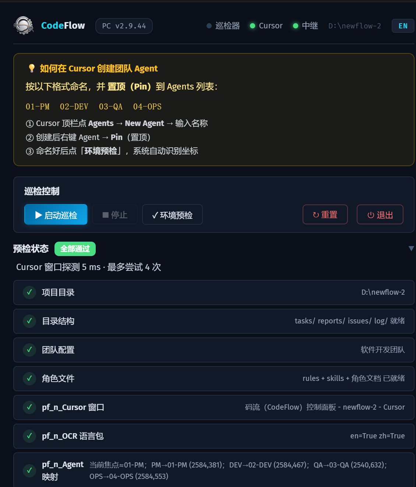
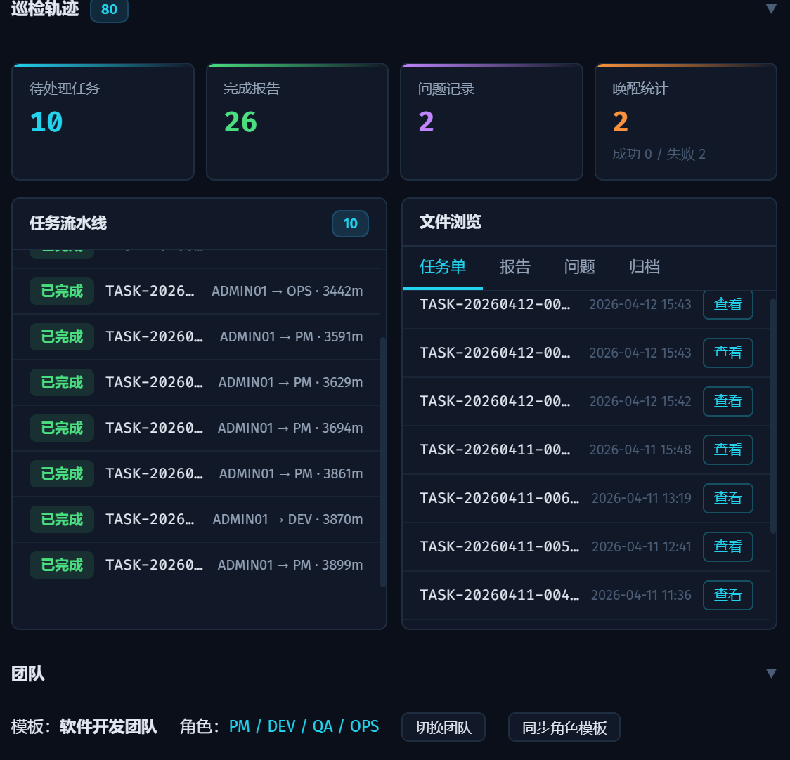
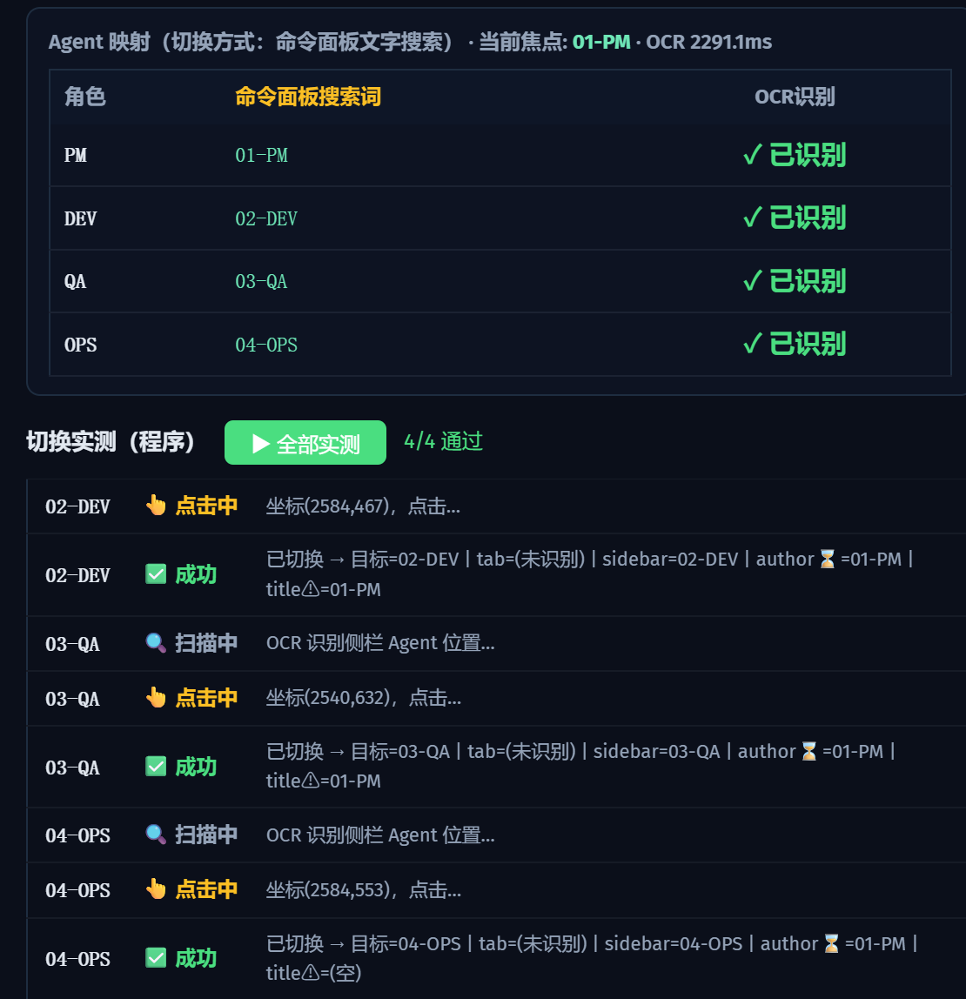
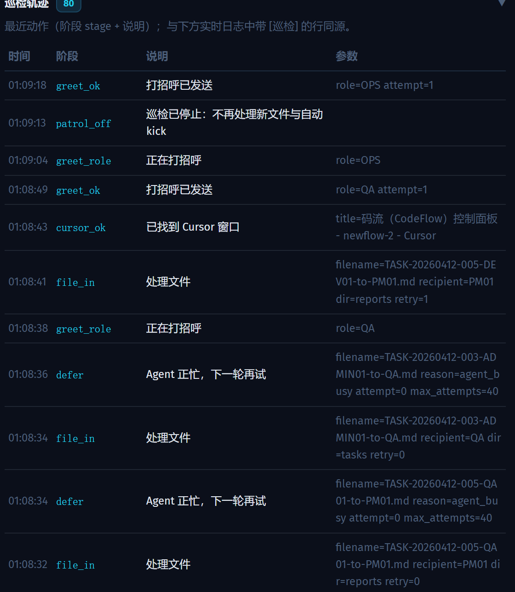
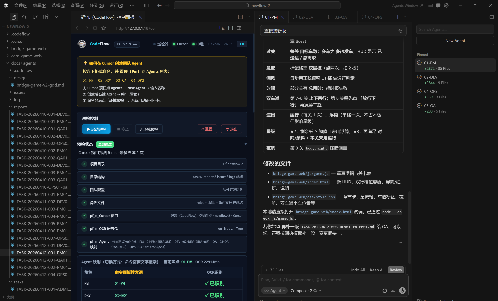
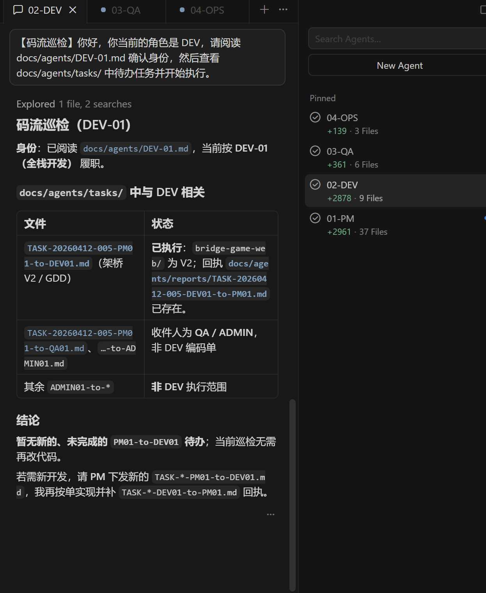
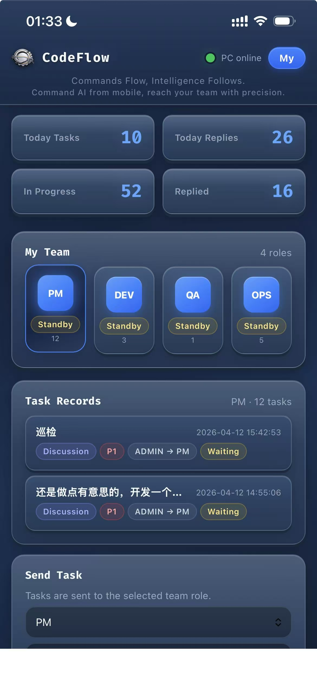
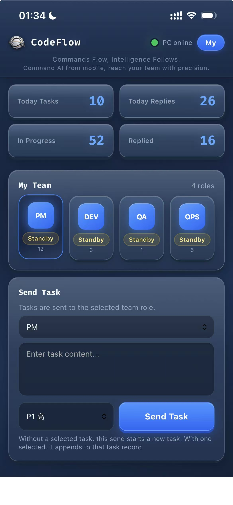
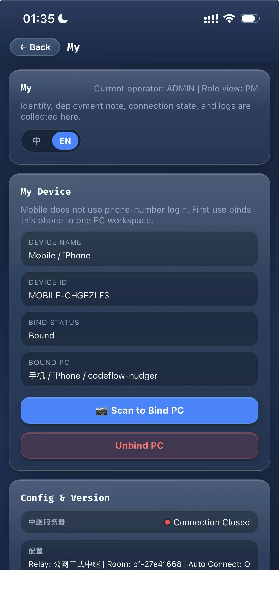

# How to Build an Automated AI Team with Cursor

## 如何在 Cursor 中搭建 AI 自动化团队

> Just tell the PM what you need, go grab a coffee, and come back to review the results.
>
> 你只需要跟 PM 说清楚要做什么，然后去喝杯咖啡，回来验收成果。

[](LICENSE)
[](https://joinwell52-ai.github.io/codeflow-pwa/)
[](https://github.com/joinwell52-AI/codeflow-pwa/releases)
[](https://joinwell52-ai.github.io/codeflow-pwa/)

[📖 English](README.en.md) | [📖 中文版](README.zh.md)

> 📜 **Project Charter / 项目宪法** —
> CodeFlow = a **lightweight AI Runtime / AI OS for multi-agent software development**, driven by `@cursor/sdk`, consuming `fcop-mcp` (consumer-side; does not define fcop).
> 码流 = **面向多 Agent 协作开发的轻量级 AI Runtime / AI OS**，用 `@cursor/sdk` 驱动、应用 `fcop-mcp`（消费方，不定义 fcop）。
> Verbatim ADMIN charter quotes (5/9 10:48 + 10:51) live in [design doc §0.0](docs/design/codeflow-v2-on-fcop-sdk.md) / 完整原话见设计文档 §0.0
>
> 🚀 **CodeFlow v2 — repositioning to AI Runtime / AI OS** ([draft]):
> [English overview (5 min)](docs/codeflow-overview.en.md) · [中文速读 (5 分钟)](docs/codeflow-overview.md) · [Full design doc / 完整设计文档](docs/design/codeflow-v2-on-fcop-sdk.md)

---

We published the methodology — [**How to Build an Automated AI Development Team in Cursor**](https://joinwell52-ai.github.io/joinwell52/) — and then built the tool to make it real.

我们先发布了方法论 — [**如何在 Cursor 中搭建 AI 自动化开发团队**](https://joinwell52-ai.github.io/joinwell52/) — 然后把它做成了产品。

**CodeFlow** (码流) is the production-ready tool born from that methodology. It turns the "filename as protocol" concept into a complete human-AI collaboration system: mobile command center + PC execution engine + multi-agent coordination.

**码流（CodeFlow）** 就是这套方法论的产品化落地。它把"文件名即协议"的理念变成了完整的人机协作系统：手机主控台 + PC 执行机 + 多角色自动调度。

**Scope / 范围：FCoP vs this repo** — The **FCoP** protocol and PyPI packages (`fcop`, `fcop-mcp`) are maintained in a **separate** GitHub repository ([joinwell52-AI/FCoP](https://github.com/joinwell52-AI/FCoP)). **This** repository is the **CodeFlow / Bridgeflow tool** line (Desktop, PWA, relay, etc.); it is not the FCoP source home. [Boundary (中文)](docs/integrations/fcop-standalone-zh.md) · [README.zh — 本仓与 FCoP](README.zh.md) · [README.en — This repo vs FCoP](README.en.md#this-repo-vs-fcop-read-this-to-avoid-mixing-them-up).

<p align="center">
  
  &nbsp;
  
  &nbsp;
  
</p>

### Why CDP / 为什么用 CDP

| | OCR (legacy) | **CDP — CodeFlow** |
|---|---|---|
| Latency 延迟 | 300–800ms | **10–15ms** |
| Accuracy 精度 | ~90% | **100%** |
| Agent Detection 角色识别 | Screenshot guess | DOM exact match |
| Setup 配置 | Manual shortcut edits | **Zero — auto-injected** |
| Fallback 降级 | None | Auto-falls back to OCR |

> **Zero-config CDP injection**: CodeFlow detects on startup whether Cursor has the debug port open. If not, it silently restarts Cursor with `--remote-debugging-port=5253` — no manual shortcut edits, no config files, nothing.
>
> **零配置 CDP 注入**：Desktop 启动时自动检测 Cursor 是否开启调试端口，若未开启则静默重启并自动注入参数，用户无需手动改快捷方式或任何配置文件。

---

### From Theory to Tool / 从理论到工具

| | Methodology 方法论 | Product 产品 |
|---|---|---|
| **Repo** | [joinwell52](https://github.com/joinwell52-AI/joinwell52) | [codeflow-pwa](https://github.com/joinwell52-AI/codeflow-pwa) |
| **What** | How to name agents, define roles, route tasks via filenames | Desktop EXE + PWA + Relay + MCP Plugin |
| **Core idea** | `TASK-date-seq-Sender-to-Recipient.md` | Same protocol, automated end-to-end |
| **Roles** | PM / DEV / QA / OPS | 3 team templates (dev / media / mvp) |
| **Human role** | Tell PM what to do | Phone sends task, PC executes |

---

### Screenshots / 产品截图

<details>
<summary><b>Desktop Panel / 桌面端控制面板</b></summary>
<p align="center">
  
  
</p>
<p align="center">
  
  
</p>
<p align="center">
  
  
</p>
</details>

<details>
<summary><b>Cursor IDE — AI Agents at Work / AI Agent 工作中</b></summary>
<p align="center">
  
</p>
<p align="center">
  
</p>
<p align="center">
  
  
</p>
</details>

<details>
<summary><b>PWA Mobile / 手机端</b></summary>
<p align="center">
  
  
  
</p>
<p align="center">
  
  
</p>
</details>

---

### Quick Start / 快速开始

**Desktop** — download EXE (~35MB) and double-click:
- China: https://gitee.com/joinwell52/cursor-ai/releases
- GitHub: https://github.com/joinwell52-AI/codeflow-pwa/releases

**PWA** — open on phone and add to home screen:
- https://joinwell52-ai.github.io/codeflow-pwa/

For full documentation, see [English](README.en.md) | [中文](README.zh.md).

---

### Development / 开发

Want to build from source or contribute? See [CONTRIBUTING.md](CONTRIBUTING.md).

```bash
# Desktop (Python 3.12, Windows)
cd codeflow-desktop
pip install pyautogui pyperclip pywin32 websockets winocr Pillow watchdog psutil
python main.py

# PWA (no build step)
python -m http.server 8080 -d web/pwa
```

Project structure:
```
codeflow-desktop/    # Desktop app (Python → EXE)
codeflow-plugin/     # Cursor MCP plugin
web/pwa/             # PWA (HTML/JS, no framework)
docs/                # Bilingual documentation
server/relay/        # WebSocket relay
```

---

### Community / 社区

- [Contributing Guide / 贡献指南](CONTRIBUTING.md)
- [Code of Conduct / 行为准则](CODE_OF_CONDUCT.md)
- [Security Policy / 安全策略](SECURITY.md)
- [Discussions / 讨论区](https://github.com/joinwell52-AI/codeflow-pwa/discussions)

### Further reading · FCoP protocol & field reports / 延伸阅读

- **[FCoP — File-based Coordination Protocol](https://github.com/joinwell52-AI/FCoP)** — the distilled protocol spec and essays behind CodeFlow's `.cursor/rules/` design / CodeFlow `.cursor/rules/` 背后的协议规范与随笔集
- [*When AI organizes its own work*](https://github.com/joinwell52-AI/FCoP/blob/main/essays/when-ai-organizes-its-own-work.md) — a 4-AI-role team delivering 87 person-days in 17 days / 4 个 AI 角色在 17 天交付 87 人日
- [*An unexplainable thing I saw: the agent didn't just comply with rules — it endorsed them*](https://github.com/joinwell52-AI/FCoP/blob/main/essays/fcop-natural-protocol.en.md) — an agent spontaneously wrote itself 4 FCoP memos on an unrelated task. [中文](https://github.com/joinwell52-AI/FCoP/blob/main/essays/fcop-natural-protocol.md) · [CSDN](https://blog.csdn.net/m0_51507544/article/details/160345043) · [Dev.to](https://dev.to/joinwell52/an-unexplainable-thing-i-saw-the-agent-didnt-just-comply-with-rules-it-endorsed-them-5ecd) · [Cursor Forum](https://forum.cursor.com/t/i-asked-cursor-to-make-a-video-it-wrote-itself-4-protocol-memos-field-report-on-rule-internalization/158524)

---

### License

MIT License. © 2026 joinwell52-AI

- Methodology: [joinwell52-ai.github.io/joinwell52](https://joinwell52-ai.github.io/joinwell52/)
- Product: [github.com/joinwell52-AI/codeflow-pwa](https://github.com/joinwell52-AI/codeflow-pwa)
- Changelog: [CHANGELOG.md](CHANGELOG.md)
